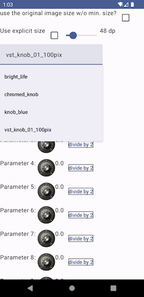
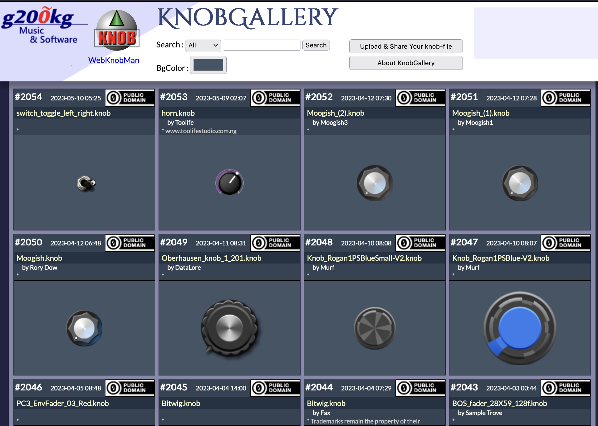

# Compose Audio Controls

It is a repository for Jetpack Compose / Compose for Multiplatform widgets
for audio apps. Well, actually currently we only have a Knob control implementation.

## ImageStripKnob



`ImageStripKnob` is a knob audio control based on an image strip.

### KnobMan image strip

It makes use of [KnobMan](https://www.kvraudio.com/product/knobman-by-g200kg) image resource. If you are curious what this means, go to [Knob Gallery](https://www.g200kg.com/en/webknobman/gallery.php). You can use these knobs without coding anything. It is a cheap trick, but offers what people really need. It is used by wide range of people in audio app industry (such as [Kontakt](https://www.native-instruments.com/en/products/komplete/samplers/kontakt-7/) instrument, Web audio/music app developers who use [webaudio-controls](http://g200kg.github.io/webaudio-controls/docs/)). It gives you a lot of choices:



### Knob UI implementation

It respects "Consider making touch targets at least 48x48dp" principle in the [Android Accessibility Help](https://support.google.com/accessibility/android/answer/7101858?hl=en) guideline. You can override it at your own risk though.

We know what musicians actually want: it is a simple single-fingered vertically draggable knob. No pinching like real knobs required.

Sometimes we want fine-tuning. If you hold 1000 milliseconds (by default) it will enter "fine mode" where the value changes are multiplied by 0.1. It will happen at any time until you release your finger or mouse pointer.

A value label tooltip will be shown when you drag over the knob. Your finger may be hiding it though; you can move the finger to left or right without changing value (to make it possible, we assign no horizontal control, at least for now). The tooltip is customizible - you can pass any `@Composable`.

It should be noted that `ImageStripKnob` is NOT a Material Design based component. You would be able to add some animation effects by your own (we also welcome contribution if it's optional and looking generally useful).

### Usage example

```kotlin
var paramValue by remember { mutableStateOf(0f) }
Text("Parameter $paramIndex: ")
ImageStripKnob(
    drawableResId = R.drawable.knob_image,
    value = paramValue,
    onValueChange = {v ->
        paramValue = v
        println("value at $paramIndex changed: $v")
        })
```

Noted that support for Android resource ID is specific to Android platform. If your project is Kotlin Multiplatform, use `ImageBitmap` instead.

## Using compose-audio-controls

Add the following `implementation` line to your dependencies list:

```groovy
dependencies {
    implementation 'org.androidaudioplugin:compose-audio-controls:+' //replace `+` with your own
}
```

The API reference is published at https://atsushieno.github.io/compose-audio-controls/ (updated for every new release tagging)

## License

compose-audio-controls is released under the MIT license.

The sample app contains some public-domain images from KnobGallery.
